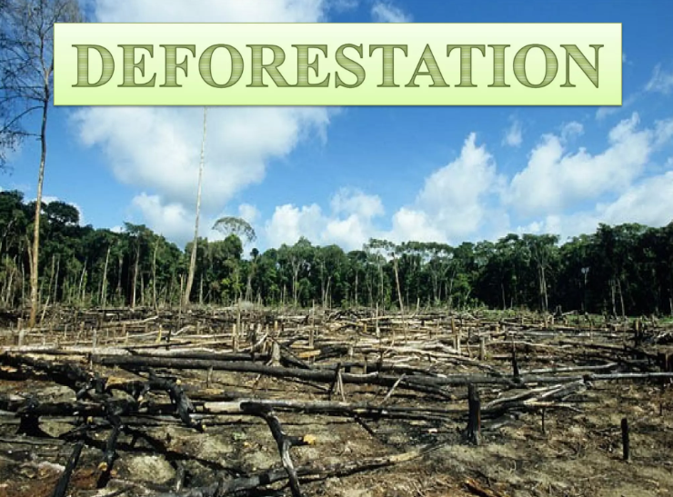

# Introduction
This is a SQL-project whic focuses on studing defprestation across different countries in different regions(continent) between the year 1990 amd 2016. It includes three tables 

The forest_area table
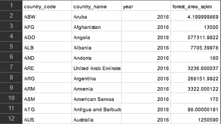

 The Land_area table 
 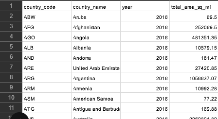
  
  The region table
  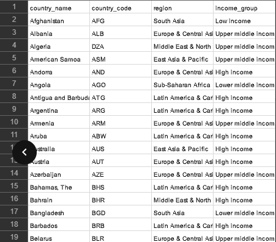

  # Problem Statement
Question 1: What are the total number of countries involved in deforestation? 

Question 2: Show the income groups of countries having total area ranging from 75,000 to 150,000 square meter?

Question 3: Calculate average area in square miles for countries in the 'upper middle income region'. Compare the result with the rest of the income categories.

Question 4: Determine the total forest area in square km for countries in the 'high income' group. Compare result with the rest of the income categories.

Question 5: Show countries from each region(continent) having the highest total forest areas. 

# Tool and Skills Demostrated
1) T-SQL
2) Data Cleaning and Transformation
3) Sub_Query
4) Window Functions

# Data Cleaning and Transformation
Step 1; I Created Database 

CODE;

`CREATE DATABASE SQL_PROJECT1;
USE SQL_PROJECT1;`

Step 2; I Imported the Csv file
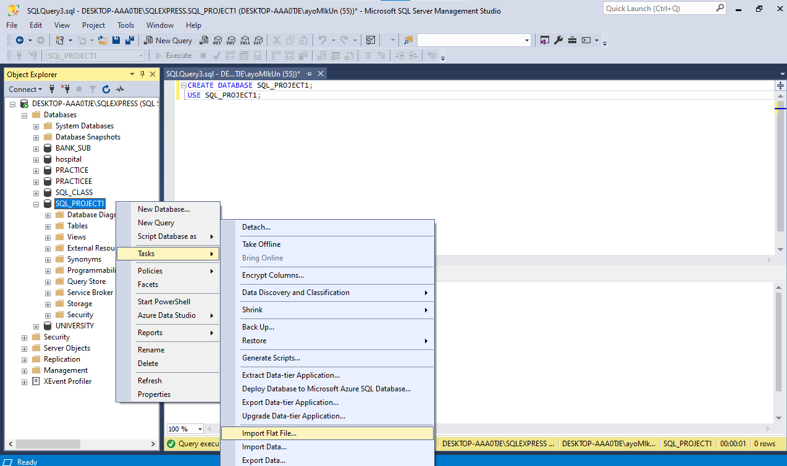

Step 3; I Loaded all files to ensure they are all imported

Code Used
`SELECT * FROM Forest_Area;
SELECT * FROM Land_Area;
SELECT * FROM Region;`
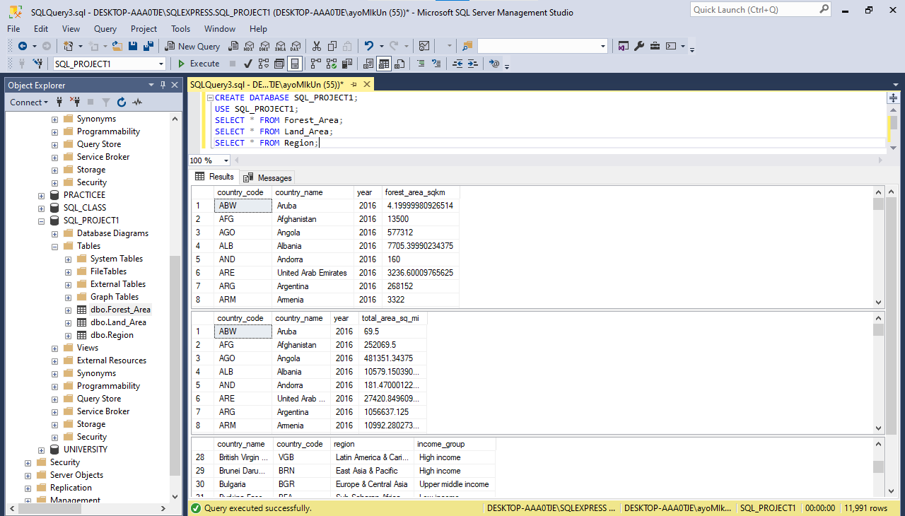

Step 4; I checked all tables for null values
Null values were found in the FOREST_AREA_SQKM coloumn in the Forest_area Table

 Correction; I replaced the null values with the average of FOREST_AREA_SQKM 
 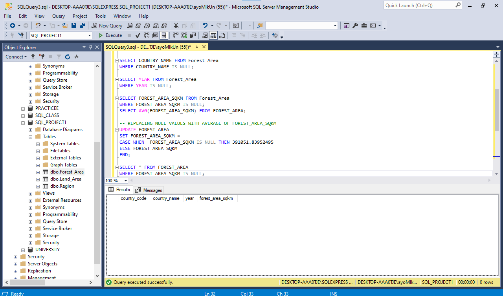

Null values were found in the TOTAL_AREA_SQ_MI coloumn in the Land_Area Table

Correction; I replaced the null values with the average of  TOTAL_AREA_SQ_MI
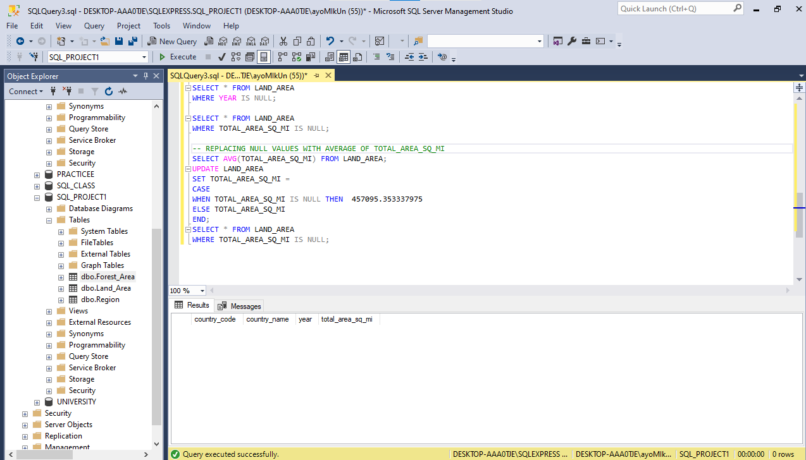

# Problem Statement
## Question 1; What are the total number of countries involved in deforestation? 
Code; `SELECT COUNT(DISTINCT COUNTRY_NAME) COUNTRIES_INVOLVED_IN_DEFORESTATION
FROM (SELECT COUNTRY_NAME, FOREST_AREA_SQKM, RANK() OVER(PARTITION BY COUNTRY_NAME ORDER BY FOREST_AREA_SQKM) RANK 
FROM FOREST_AREA) RC
WHERE RANK != 1;`
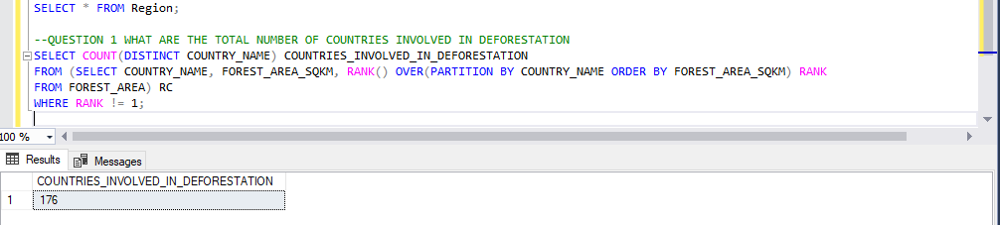

## Question 2: Show the income groups of countries having total area ranging from 75,000 to 150,000 square meter?
Code; `SELECT R.COUNTRY_NAME, R.INCOME_GROUP, L.TOTAL_AREA_SQ_MI 
FROM REGION R 
FULL JOIN  LAND_AREA L 
ON R.COUNTRY_CODE = L.COUNTRY_CODE
WHERE TOTAL_AREA_SQ_MI BETWEEN 75000 AND 150000;`
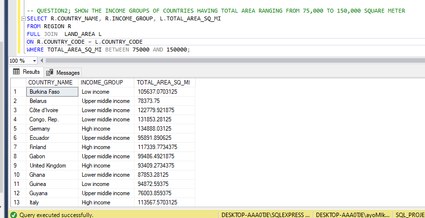

## Question 3: Calculate average area in square miles for countries in the 'upper middle income region'. Compare the result with the rest of the income categories.
Code; `SELECT INCOME_GROUP, AVG(TOTAL_AREA_SQ_MI) AS AVG_AREA
FROM REGION R
FULL JOIN LAND_AREA L 
ON R.COUNTRY_CODE = L.COUNTRY_CODE
GROUP BY INCOME_GROUP
HAVING INCOME_GROUP IN ( 'UPPER MIDDLE INCOME','LOW INCOME','HIGH INCOME')
ORDER BY AVG(TOTAL_AREA_SQ_MI) DESC;`
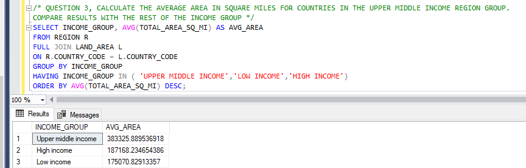

The Upper Middle Group have an average area of 383325.889536918 SQUARED MILES , The High Income Group have an average area of 187168.234654386 SQUARED MILES, The Low Income Group have an average area of 175070.82913357 SQUARED MILES. The Upper Middle Group have a larger average area compared to other income groups.

## Question 4: Determine the total forest area in square km for countries in the 'high income' group. Compare result with the rest of the income categories.
Code; `SELECT INCOME_GROUP, SUM(FOREST_AREA_SQKM) AS TOTAL_FOREST_AREA 
FROM REGION R
JOIN FOREST_AREA F
ON R.COUNTRY_CODE = F.COUNTRY_CODE
GROUP BY INCOME_GROUP
HAVING INCOME_GROUP IN ('UPPER MIDDLE INCOME', 'LOW INCOME', 'HIGH INCOME')
ORDER BY SUM(FOREST_AREA_SQKM);`

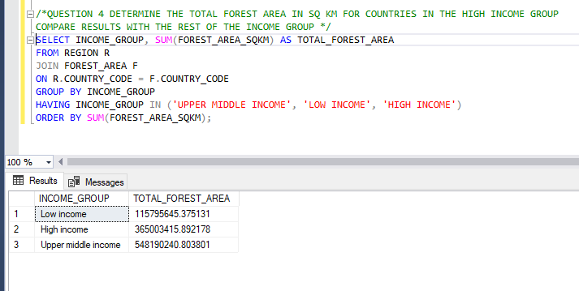

The total forest area for countries in the High Income Group is 365003415.892178 KILOMETER SQUARED,The total forest area for countries in the Low Income Group is 115795645.375131 KILOMETER SQUARED, The total forest area for countries in the Upper Middle Group is 548190240.803801 KILOMETER SQUARED. The Upper Middle Group have a larger Total Forest Area  of 548190240.803801   KILOMETER SQUARED compared to other groups

## Question 5: Show countries from each region(continent) having the highest total forest areas. 
Code; `SELECT * FROM(
SELECT R.COUNTRY_NAME, REGION, RANK() OVER(PARTITION BY R.COUNTRY_NAME ORDER BY FOREST_AREA_SQKM DESC) AS RANK_OF_COUNTRIES
FROM
REGION R
FULL JOIN FOREST_AREA F
ON R.COUNTRY_CODE = F.COUNTRY_CODE
GROUP BY R.COUNTRY_NAME,R.REGION,F.FOREST_AREA_SQKM) RC
WHERE RANK_OF_COUNTRIES = 1;`

# Insights

1) The Upper Middle Group have an average area of 383325.889536918 SQUARED MILES , The High Income Group have an average area of 187168.234654386 SQUARED MILES, The Low Income Group have an average area of 175070.82913357 SQUARED MILES. The Upper Middle Group have a larger average area compared to other income groups.
   
2) The total forest area for countries in the High Income Group is 365003415.892178 KILOMETER SQUARED,The total forest area for countries in the Low Income Group is 115795645.375131 KILOMETER SQUARED, The total forest area for countries in the Upper Middle Group is 548190240.803801 KILOMETER SQUARED. The Upper Middle Group have a larger Total Forest Area  of 548190240.803801   KILOMETER SQUARED compared to other groups

